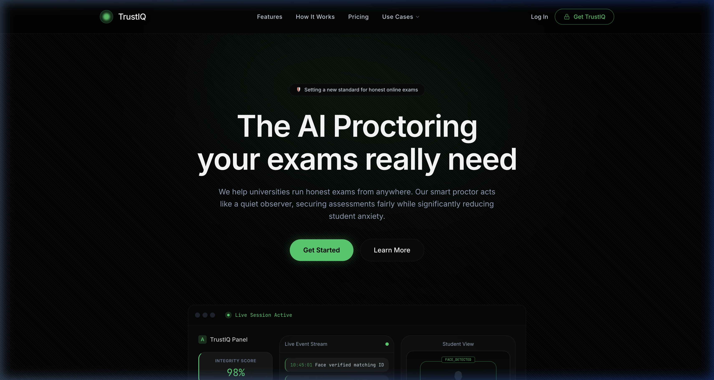
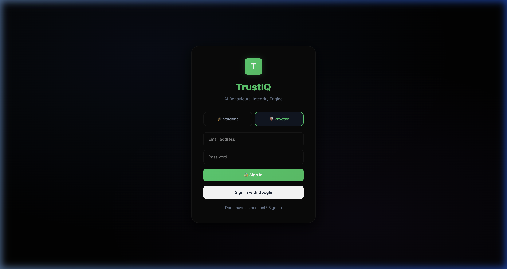
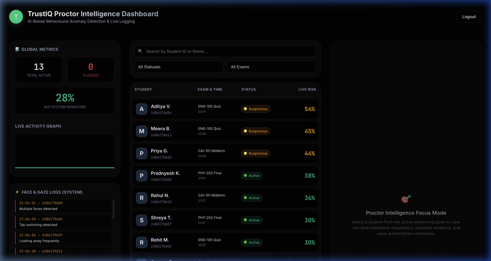
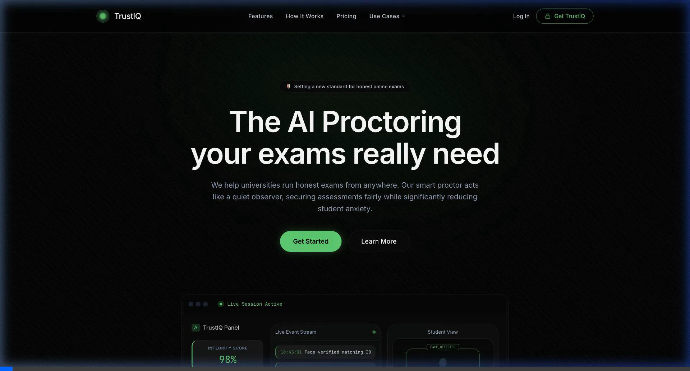

<div align="center">

# 🛡️ TrustIQ

### *AI Behavioural Integrity Engine*

> **The AI Proctoring your exams really need.**
> We help universities run honest exams from anywhere — our smart proctor acts like a quiet observer, securing assessments fairly while significantly reducing student anxiety.

<br/>

[](https://fastapi.tiangolo.com/)
[](https://reactjs.org/)
[](https://firebase.google.com/)
[](https://mediapipe.dev/)
[](https://python.org/)
[](https://opensource.org/licenses/MIT)

</div>

---

## 📋 Table of Contents

- [Overview](#-overview)
- [Screenshots](#-screenshots)
- [Demo Video](#-demo-video)
- [Features](#-features)
- [How It Works](#-how-it-works)
- [Tech Stack](#-tech-stack)
- [Project Structure](#-project-structure)
- [Getting Started](#-getting-started)
- [Security Architecture](#-security-architecture)
- [AI Intelligence Layers](#-ai-intelligence-layers)
- [Author](#-author)

---

## 🌟 Overview

**TrustIQ** is a full-stack, AI-powered online examination proctoring SaaS platform. It simulates a real human proctor sitting beside the student — watching, listening, and reacting in real time — completely automatically through the student's browser.

Traditional online exams are trivially easy to cheat in. TrustIQ eliminates that by combining **computer vision, audio analysis, behavioral biometrics, and browser lockdown** to continuously evaluate student behavior and flag anomalies as they happen.

> _"Quiet observation. Intelligent detection. Zero tolerance for cheating."_

---

## 📸 Screenshots

### 🏠 Landing Page

*The TrustIQ marketing landing page featuring a live dashboard preview mockup, feature highlights, and pricing tiers.*

---

### 🔐 Login Portal

*Multi-role login supporting both Student and Proctor access with Google Sign-In and email/password auth.*

---

### 🎛️ Proctor Intelligence Dashboard

*Real-time monitoring dashboard showing live risk scores, behavioral event logs, and anomaly detection across all active exam sessions.*

---

## 🎬 Demo Video

> A live walkthrough of the system — from the landing page, through login, and into the Proctor Dashboard monitoring active students in real time.



---

## ✨ Features

### 🎓 For Students
- **Smooth Exam Interface** — Distraction-free fullscreen portal with a question navigator and section tabs
- **Transparent Monitoring** — Live camera feed always visible to the student for fairness
- **Verbal AI Warnings** — The AI proctor *speaks out loud* when an anomaly is detected via Web Speech API
- **5-Second Proctor Lockdown** — Un-dismissable penalty screen freezes the exam on serious infractions
- **Live Timer & Integrity Score** — Real-time countdown with a per-student integrity percentage
- **Review Mode** — Mark questions for review before final submission

### 🔍 For Proctors
- **Real-Time Monitoring** — All active students on one screen with live risk scores updating every second
- **Live Event Feed** — Timestamped behavioral event log ("Multiple faces detected", "Tab switching", "Looking away")
- **Student Focus Mode** — Click any student to view full diagnostics, snapshot evidence, and issue actions
- **Search & Filter** — Filter students by risk level (Flagged / Suspicious / Active) or exam
- **Global Metrics** — Total active, flagged students, and average system risk score at a glance
- **Exam Report Export** — Download per-student behavioral integrity reports

### 🔒 Security & Integrity
- 🎙️ **AI Voice Proctor** — Spoken warnings via `speechSynthesis` on every infraction
- 🛡️ **5-Second Lockdown Modal** — Full-screen un-closable penalty overlay
- 🚫 **Keyboard Lockdown** — Blocks Copy, Cut, Paste, Select All, Print, Save, DevTools
- 🖱️ **Right-Click Blocked** — `contextmenu` is disabled throughout the exam
- 📺 **Fullscreen Enforcement** — Exiting fullscreen triggers immediate voice + lockdown
- 🔌 **Extension Detection** — Detects ChatGPT, Grammarly, AI sidebars, React DevTools
- 👁️ **Vision Monitoring** — Real-time gaze, face count, and lip movement analysis via camera

---

## ⚙️ How It Works

```
Student opens TrustIQ → Auth via Firebase → Selects exam
              ↓
     Camera & Mic initialized (with user permission)
              ↓
         Gaze calibration phase
              ↓
     Exam starts — AI monitoring begins silently
              ↓
┌──────────────────────────────────────────────────┐
│  CONTINUOUS MONITORING LOOP (every 500ms)        │
│                                                  │
│  Vision AI  →  Gaze | Face Count | Lip Movement │
│  Audio AI   →  Volume | Whisper Analysis         │
│  Browser    →  Tab focus | Keyboard | Extensions │
│  Biometrics →  Keystroke dynamics | Mouse moves  │
│                                                  │
│  All data streamed via WebSocket → FastAPI       │
│  → AI models score → Risk % recalculated         │
└──────────────────────────────────────────────────┘
              ↓
     Anomaly detected?
     ├── YES → TTS voice fires out loud
     │         5-second lockdown modal activates
     │         Proctor dashboard alerted in real-time
     │         Student integrity score decreases (-10pts)
     └── NO  → Continue silent monitoring
              ↓
     Exam submitted → Session ends → Report generated
```

---

## 🏗️ Tech Stack

| Layer | Technology | Purpose |
|---|---|---|
| **Frontend** | React 18 + Vite | Exam portal & Proctor dashboard |
| **Styling** | Tailwind CSS | Premium OLED dark design system |
| **Backend** | FastAPI (Python) | REST API + WebSocket server |
| **Real-Time** | WebSockets | Live frame/audio/risk data streaming |
| **Auth** | Firebase Authentication | Multi-role login (Student / Proctor) |
| **Database** | Cloud Firestore | User profiles, session metadata |
| **Vision AI** | MediaPipe + OpenCV | Face, gaze & lip movement detection |
| **Audio AI** | Librosa | Background noise & whisper analysis |
| **Behavioral** | Custom JS Hooks | Keystroke dynamics & mouse tracking |

---

## 📁 Project Structure

```
TrustIQ/
├── backend/                    # FastAPI backend
│   ├── app.py                  # Main API + WebSocket server
│   ├── schemas.py              # Pydantic models
│   └── session_manager.py      # Active session tracker
│
├── models/                     # AI sub-modules
│   ├── vision/
│   │   ├── face_detector.py          # Multi-face detection
│   │   ├── gaze_detector.py          # Eye gaze tracking
│   │   ├── lip_movement_detector.py  # Whisper detection
│   │   └── vision_analyzer.py        # Vision orchestrator
│   ├── audio/                  # Audio analysis
│   ├── behavior/               # Behavioral biometrics
│   ├── stylometry/             # Writing style analysis
│   └── fusion/                 # Multi-modal risk fusion
│
├── frontend/
│   ├── src/
│   │   ├── pages/
│   │   │   ├── Landing.jsx           # Marketing landing page
│   │   │   ├── Login.jsx             # Multi-role auth
│   │   │   ├── ExamPortal.jsx        # Student exam interface
│   │   │   └── ProctorDashboard.jsx  # Proctor command center
│   │   ├── hooks/
│   │   │   ├── useMediaCapture.js        # Camera & mic capture
│   │   │   ├── useExamWebSocket.js       # WebSocket manager
│   │   │   ├── useExtensionDetector.js   # Extension detection
│   │   │   ├── useKeystrokeTracker.js    # Keystroke biometrics
│   │   │   └── useMouseTracker.js        # Mouse tracking
│   │   ├── firebase.js           # Firebase config
│   │   └── index.css             # TrustIQ design tokens
│   └── index.html
│
├── docs/
│   └── screenshots/            # Project screenshots
│
├── main.py                     # Entry point
└── README.md
```

---

## 🚀 Getting Started

### Prerequisites

- Python 3.9+
- Node.js 18+
- A Firebase project with **Authentication** and **Firestore** enabled

### 1. Clone the Repository

```bash
git clone https://github.com/your-username/trustiq.git
cd trustiq
```

### 2. Backend Setup

```bash
# Install Python dependencies
pip install -r requirements.txt

# Start the FastAPI backend
python main.py
# → Runs on http://localhost:8000
```

### 3. Frontend Setup

```bash
cd frontend

# Install dependencies
npm install

# Start the dev server
npm run dev
# → Runs on http://localhost:5173
```

### 4. Firebase Configuration

Update `frontend/src/firebase.js` with your Firebase project credentials:

```js
const firebaseConfig = {
  apiKey: "YOUR_API_KEY",
  authDomain: "YOUR_PROJECT_ID.firebaseapp.com",
  projectId: "YOUR_PROJECT_ID",
  storageBucket: "YOUR_PROJECT_ID.appspot.com",
  messagingSenderId: "YOUR_SENDER_ID",
  appId: "YOUR_APP_ID"
};
```

### 5. Open the App

Navigate to **[http://localhost:5173](http://localhost:5173)** and register as a Student or Proctor.

---

## 🔐 Security Architecture

### Student Portal Lockdown (Active During Exam)

| Protection | Mechanism |
|---|---|
| Fullscreen enforcement | `requestFullscreen()` + exit detection |
| Tab switch detection | `visibilitychange` + `window.blur` events |
| Copy / Paste blocking | `copy`, `cut`, `paste` event prevention |
| Keyboard shortcut blocking | `keydown` intercept for Ctrl/Cmd/Alt combos |
| Right-click blocking | `contextmenu` event prevention |
| AI Voice Warning | Web `SpeechSynthesis` API |
| Penalty Lockdown Screen | 5-second un-dismissable modal overlay `z-[9999]` |

### Extension Detection System

TrustIQ scans for cheating tools by inspecting DOM mutations and known markers:
- **AI Tools**: ChatGPT / Sider / Monica / Merlin sidebars
- **Writing Aids**: Grammarly inline suggestions
- **Developer Tools**: React DevTools, browser console extensions
- **Generic**: Shadow DOM injections from unknown extensions

### Gaze & Face Monitoring

Vision data is processed server-side via MediaPipe:
- 🔴 **No face detected** → Immediate flag (student left screen)
- 🔴 **Multiple faces** → Automatic 85%+ risk escalation (someone else present)
- 🟡 **Gaze away** → Gradual risk increase based on duration
- 🟡 **Lip movement** → Whisper detection triggers warning

---

## 🤖 AI Intelligence Layers

### Vision Anomaly Score (Weighted Fusion)

| Sub-Module | Weight | What It Detects |
|---|---|---|
| Gaze Detector | **40%** | Eyes looking away from screen |
| Face Detector | **35%** | No face / multiple faces present |
| Lip Movement Detector | **25%** | Whispering or speaking during exam |

### Risk Score Formula

```python
anomaly_score = (
    0.40 * gaze_score      +  # Looking away from screen
    0.35 * face_score      +  # Face presence anomaly
    0.25 * lip_score          # Lip movement / whispering
)

# Special override:
if multiple_faces_detected:
    anomaly_score = max(anomaly_score, 0.85)

# Student's Integrity Score displayed:
integrity_score = max(0, round(100 - anomaly_score))
```

All scores are streamed live to the Proctor Dashboard via WebSocket every **500ms**.

---

## 👨‍💻 Author

**Pradnyesh K.**
> Built in 2026 as a demonstration of AI-powered academic integrity systems.
> Full-stack project combining computer vision, behavioral biometrics, and modern web engineering.

---

<div align="center">

**TrustIQ** — *Because academic integrity shouldn't depend on who's watching.*

© 2026 TrustIQ SaaS. Made with ❤️ by Pradnyesh K.

</div>
